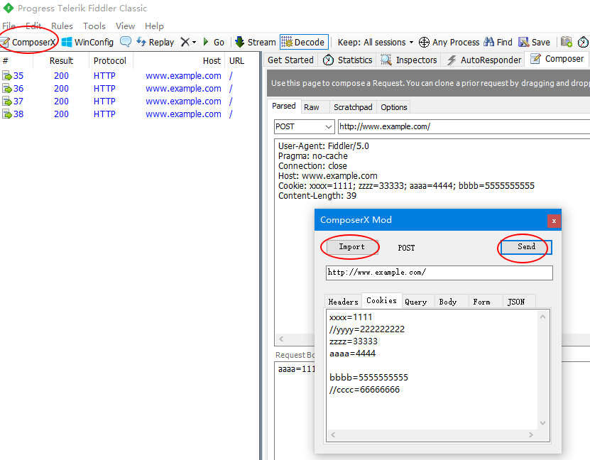

# Fiddler ComposerX Mod

ComposerX is a Fiddler Classic extension that improves upon the original Composer, allowing for easier editing of HTTP requests.

* In ComposerX, request headers, cookies, query string, and form body are parsed into multiple lines of text, with each line displaying one item. You can conveniently add or remove items, and you can temporarily ignore an item by prefixing the line with `//`. You can also hold down the `Ctrl` key and click on a line to toggle it.

* Fixed a UI freeze bug of Fiddler Classic: when you are on the `Raw` response tab of the `Inspectors` and select a session with a very large body, it may cause the UI to freeze.
This extension fixes this issue by automatically switching to the `Headers` inspector tab when it detects that the `Raw`, `TextView` or `SyntaxView` are active, and the session body is larger than 300KB.

* Add a `Compare` tab page to the right panel. You can drag and drop a session onto it, then format and compare two sessions.

* Add a `Copy as cURL Script` menu item to the right-click content menu of a session.

### Install

Download the `FiddlerComposerX.dll` and `Newtonsoft.Json.dll` and place them under `%UserProfile%\Documents\Fiddler2\Scripts` directory.

Then restart Fiddler Classic.

### Screenshot

